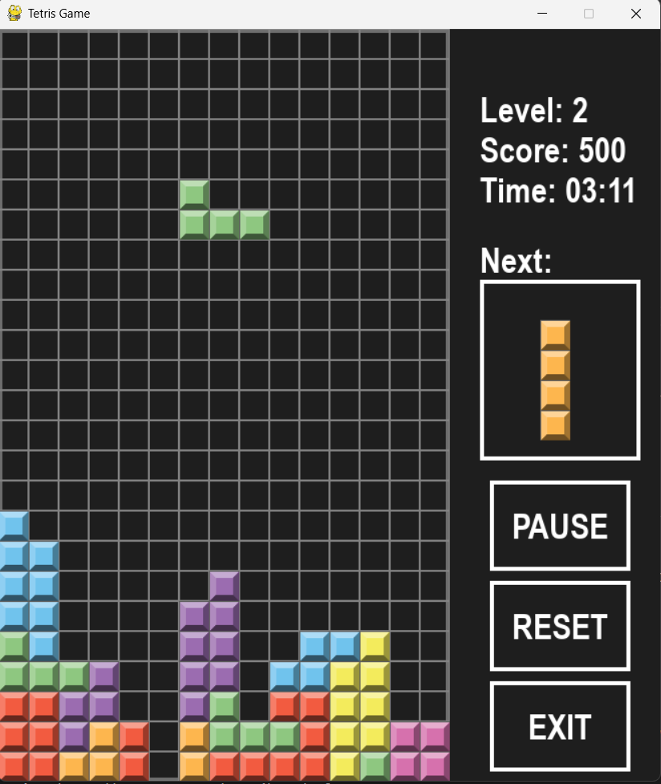

# TetrisGame 🎮

## Giới thiệu

**TetrisGame** là một trò chơi Tetris cổ điển được xây dựng bằng **Python** và thư viện **pygame**.
Dự án mô phỏng lại các chức năng cơ bản và cốt lõi của trò chơi như điều khiển khối rơi, xoay khối, xóa hàng và tính điểm, đồng thời cung cấp giao diện trực quan và dễ sử dụng.
Người chơi sẽ điều khiển các khối hình rơi xuống, sắp xếp chúng để tạo thành các hàng hoàn chỉnh, từ đó ghi điểm và thử thách khả năng phản xạ cũng như tư duy chiến thuật của bản thân.

## Mục tiêu chính

- Thực hành ngôn ngữ lập trình Python.
- Rèn luyện tư duy lập trình game cơ bản.
- Làm quen với mô hình **event-driven**, **game loop** và cách để lập trình game.
- Biết cách tổ chức logic game và quản lý trạng thái.

## Tính năng

- Giao diện đồ họa 2D đơn giản và trực quan.
- Điều khiển các khối Tetromino (O, I, J, L, S, Z, T).
- Cơ chế điều khiển linh hoạt cho phép xoay, di chuyển và tăng tốc rơi các khối hình.
- Tự động xóa hàng khi hoàn thành.
- Hệ thống tự động tính điểm và tăng cấp độ theo level.
- Hiển thị khối hình tiếp theo.
- Nhạc nền sống động, mang lại cảm giác hứng khởi khi chơi.
- Các nút điều khiển **Pause / Reset / Exit**.

## Giao diện & Đồ họa

<p align="center">
  
</p>

## Công nghệ sử dụng

- **Ngôn ngữ**: Python 3  
- **Thư viện**: pygame  
- **Mô hình lập trình**:
  - Event-driven
  - Game loop
  - Lập trình hướng đối tượng (OOP)

## Cách chạy chương trình

### 1. Cài đặt Python
Đảm bảo máy đã cài **Python 3.x**

### 2. Cài đặt thư viện pygame & Chạy game
```bash
pip install pygame
python main.py
